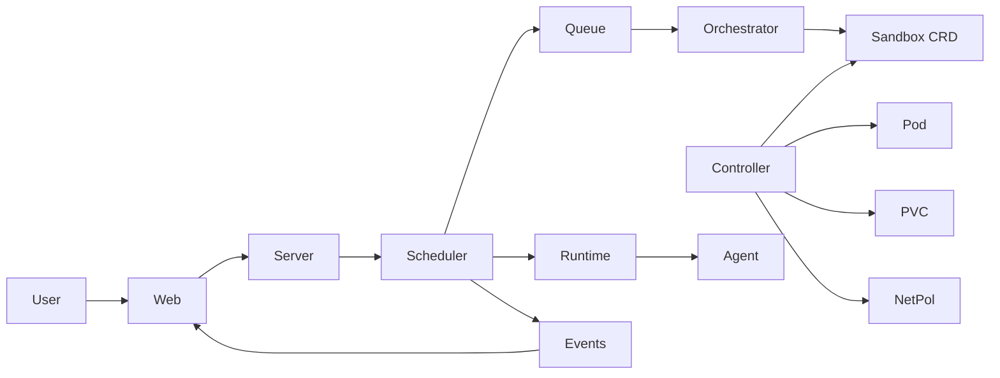

# Devin (devin.baby)

**devin.baby** is a mini Devin focused on the core software-engineering loop: submit work, get an isolated runtime, run the agent, stream progress, and persist results in `/workspace`.

Sandboxes are an internal implementation detail. Users submit **Tasks**.

## Architecture



### Request flow

1. User → `POST /api/v1/tasks` `{ "prompt": "Build a Next.js auth system" }`
2. **Server** authenticates and forwards to **Scheduler**
3. **Scheduler** enqueues work and emits `task.created`
4. Worker creates a **Sandbox CRD** via **Orchestrator** (internal API)
5. **Controller** reconciles Pod + PVC + NetworkPolicy
6. **Runtime supervisor** starts inside the pod
7. Scheduler calls `POST /run` on the runtime — never shell on the host
8. Events stream over SSE: `GET /api/v1/tasks/{id}/events`

### Repository layout

```
devin/
├── apps/
│   ├── web/                 # Dashboard
│   ├── server/              # API gateway (auth + task proxy)
│   ├── scheduler/           # Task queue worker + SSE events
│   ├── orchestrator/        # Sandbox CRD controller + internal API
│   └── runtime/             # In-pod supervisor (PID 1)
├── packages/
│   ├── orchestrator/        # K8s reconciliation logic
│   ├── sandbox/             # Sandbox CRD types
│   ├── scheduler/           # Task scheduling library
│   ├── services/
│   │   ├── email/           # Resend client
│   │   └── queue/           # Task queue (memory + SQS)
│   ├── events/              # Event bus + SSE helpers
│   └── agent-sdk/           # Runtime HTTP client contract
├── deploy/
│   ├── kubernetes/          # CRD, RBAC, deployments
│   └── helm/                # Helm chart scaffold
└── runtime-images/          # nextjs, go, rust, node, python
```

### Kubernetes namespaces

| Namespace | Workloads |
| --- | --- |
| `devin-app` | web, server |
| `devin-system` | scheduler, orchestrator |
| `devin-sandboxes` | sandbox pods (created by controller) |

### Runtime supervisor API

Every sandbox pod runs the runtime supervisor:

| Method | Path | Purpose |
| --- | --- | --- |
| POST | `/run` | Execute agent task |
| POST | `/terminal` | Shell commands |
| POST | `/git/clone` | Clone repository |
| POST | `/git/commit` | Commit changes |
| POST | `/files/write` | Write workspace files |
| POST | `/browser/open` | Browser automation |
| GET | `/health` | Liveness |
| GET | `/logs` | Supervisor logs |
| GET | `/events` | Runtime event stream |

The orchestrator **never** executes shell commands — it only provisions infrastructure and talks to the runtime over HTTP.

### Persistence

```
Task → Sandbox CRD → Pod → PVC (/workspace)
```

If a pod crashes, a new pod mounts the same PVC and the task can resume.

### Future evolution

Only the isolation backend is swappable:

```
Today:     Controller → Pod
Later:     Controller → Firecracker / Kata / gVisor
```

API, Scheduler, Runtime contract, Agent, and UI stay the same.

## Local development

```sh
bun install

# terminal 1 — orchestrator (dry-run)
ORCHESTRATOR_DRY_RUN=true bun run dev --filter=@devin/orchestrator-app

# terminal 2 — runtime supervisor
bun run dev --filter=@devin/runtime

# terminal 3 — scheduler worker
bun run dev --filter=@devin/scheduler-app

# terminal 4 — API + web
bun run dev --filter=@devin/server
bun run dev --filter=@devin/web
```

Create a task:

```sh
curl -X POST http://localhost:8080/api/v1/tasks \
  -H 'Content-Type: application/json' \
  -d '{"prompt":"Build a Next.js auth system"}'
```

Stream events:

```sh
curl -N http://localhost:9091/api/v1/tasks/{taskId}/events
```

## Kubernetes deploy

```sh
kubectl apply -f deploy/kubernetes/namespaces.yaml
kubectl apply -f deploy/kubernetes/crd/
kubectl apply -f deploy/kubernetes/orchestrator/
kubectl apply -f deploy/kubernetes/scheduler/
```

Set on server: `SCHEDULER_URL=http://devin-scheduler.devin-system.svc:9091`

## Scripts

| Command | Description |
| --- | --- |
| `bun run dev` | Start all apps |
| `bun run build` | Build all apps and packages |
| `bun run lint` | Lint the monorepo |
| `bun run check-types` | TypeScript type checking |
